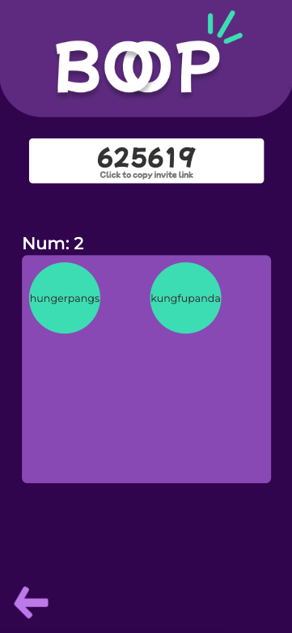

  

 

<h1 
  align=center
>
  Welcome to BOOP!
</h1>

## TRY IT <a href="https://boop-eight.vercel.app/">HERE</a>

 
 

## Start a boop 🚀

---

 

  

    <h3>
      1.  
      Key in parameters
    </h3>
    
  

   
   
  
  

    <h3>
      2.  
      State your preference
    </h3>
    
  

   
   

  

    <h3>
      3.  
      Wait for choices
    </h3>
    
  

  
   
   
  
  

    <h3>
      4.  
      Boop it!
    </h3>
    
  

 
 
 

## Join a boop 👍

---

 

  

    <h3>
      1.  
      Key in room info
    </h3>
    
  

   
   
  
  

    <h3>
      2.  
      State your preference
    </h3>
    
  

   
   

  

    <h3>
      3.  
      Wait for choices
    </h3>
    
  

  
   
   
  
  

    <h3>
      4.  
      Choice made!
    </h3>
    
  

 
 

## Limitations ⚠️ :

---

- Boop only works when the admin's tab is ACTIVE
- It is meant to be used when the group is gathered in real life, because it relies on socket connections to keep it alive

 
 

## Tech Used 🔨

---

### Frontend

- React
- Gatsby
- styled-components
- isomorphic-ws (websocket)

### Backend

- Serverless
- AWS
  - DynamoDB
  - Lambda
  - API Gateway

 
 

## Reflections 🪞

---

First time implementing websockets with serverless! It took a while to get used to,,, but hopefully the cost savings will make it worth while :D

After doing a quick Udemy course on Figma, this was the first time I put it to practise and used it to design the uiux of the app. It was a first for me! Probably a skill that I will put into practise in the future as well.

Overall a really fun project, but it is only optimised for mobile, really didn't care much about user experience for desktop users but will get to it soon!
